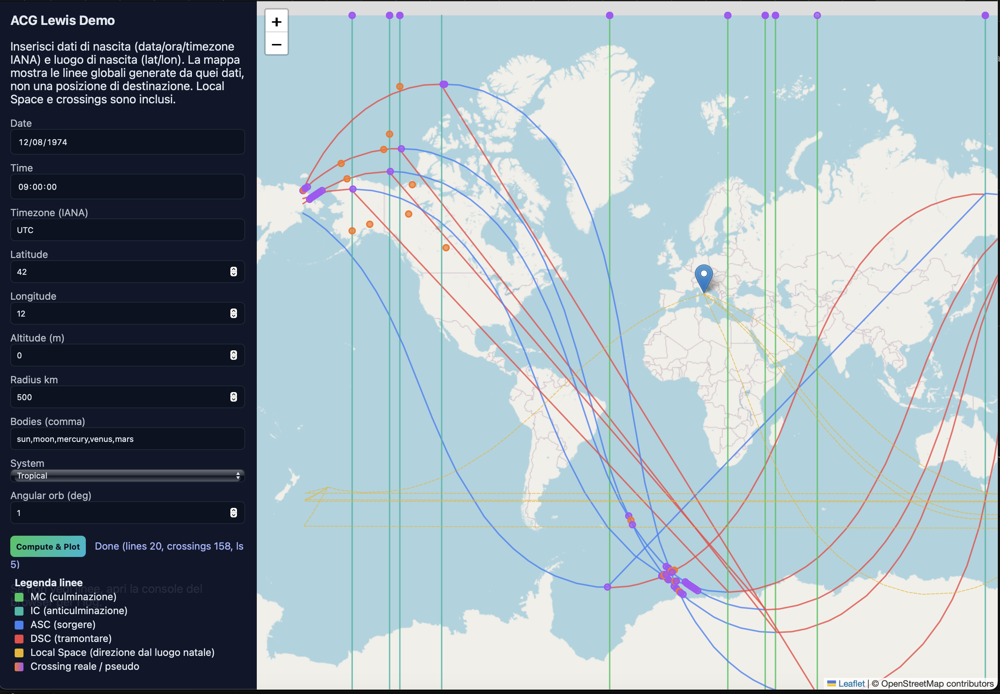

# acg-lewis

Astronomically-correct Astro*Carto*Graphy calculations (Jim Lewis style) using Swiss Ephemeris. Map-agnostic: only structured data outputs (JSON, GeoJSON-ready).



## Features
- Swiss Ephemeris (equatorial, topocentric, true positions) with tropical/sidereal (ayanamsa selectable)
- Core outputs: RA/DEC, ecliptic lon/lat, distance, GST/LST
- ACG lines: MC/IC (vertical), ASC/DSC (curves with refraction option), GeoJSON-ready, crossings detection
- Parans detection (planet-planet, angle-angle) with configurable orb
- Local Space great-circle directions
- Relocation charts with multiple house systems (Placidus, Koch, Equal, Whole Sign)
- Location analysis: active lines near a city, strength ranking (Lewis priorities + personal/transpersonal weighting), parans nearby, force decay
- Configurable orbs, sampling step, refraction/parallax flags (Moon true position), julian/gregorian calendars
- JSON Schemas (Zod) exported for validation (`src/schema.ts`)

## Install
```bash
npm install acg-lewis swisseph luxon
```

> Swiss Ephemeris requires ephemeris data files; set `ephemerisPath` to your `.se1` directory or rely on builtin if available.

## Quick start
```ts
import { computeACG, computeParans, computeLocalSpace, computeRelocationChart, analyzeLocation } from 'acg-lewis';

const datetime = { year: 1990, month: 1, day: 1, hour: 12, minute: 0, timezone: 'UTC' };
const bodies = ['sun', 'moon', 'mercury', 'venus', 'mars'] as const;
const opts = { system: 'tropical', angularOrbDeg: 1, samplingStepDeg: 2, geoOrbKm: 300, cache: true };

const acg = computeACG(datetime, opts, bodies);
const parans = computeParans(datetime, opts, bodies, 2);
const ls = computeLocalSpace(datetime, { lat: 40, lon: -3, alt: 0 }, opts, bodies);
const relocation = computeRelocationChart(datetime, { lat: 40, lon: -3, alt: 0 }, opts);
const analysis = analyzeLocation({ lat: 40, lon: -3, alt: 0 }, 500, acg, parans.parans, opts);

// Validate against schema if needed
// import { ACGLinesResultSchema } from 'acg-lewis';
// ACGLinesResultSchema.parse(acg);
```

## API Reference

### `computeACG(datetime, options, bodies, baseLocation?)`
Calcola le linee AstroCartoGraphy (MC, IC, ASC, DSC) per i corpi specificati.
- **Input**: data/ora, opzioni di calcolo, elenco corpi celesti, luogo natale opzionale
- **Output**: oggetto con `lines` (coordinate geografiche dove ciascun corpo è angolare), `crossings` (incroci tra linee), `bodies` (posizioni calcolate), `gst` (tempo siderale)
- **Uso**: mappa globale delle linee angolari; base per tutte le altre analisi

### `computeParans(datetime, options, bodies, maxOrbDeg)`
Trova i parans (simultanea angularità di due corpi su angoli diversi alla stessa latitudine).
- **Input**: data/ora, opzioni, corpi, orb massimo in gradi
- **Output**: array di `Paran` con latitudine, coppia corpi, coppia angoli, orb residuo
- **Uso**: identifica latitudini dove due pianeti sono simultaneamente angolari (es. Sole su ASC e Luna su MC)

### `computeLocalSpace(datetime, location, options, bodies)`
Genera linee Local Space (grande cerchio dal luogo natale nella direzione azimutale di ciascun corpo).
- **Input**: data/ora, luogo di origine, opzioni, corpi
- **Output**: `origin` (luogo natale), `lines` (coordinate del grande cerchio per ogni corpo con `bearing`)
- **Uso**: mostra direzioni cardinali dal luogo di nascita verso ciascun pianeta

### `computeRelocationChart(datetime, location, options)`
Calcola gli angoli (ASC/MC/IC/DSC) e le case per un luogo di rilocazione.
- **Input**: data/ora, luogo di destinazione, opzioni
- **Output**: `angles` (ASC, MC, IC, DSC, vertex, equasc), `houses` (cuspidi per sistemi Placidus, Koch, Equal, Whole Sign)
- **Uso**: carta astrologica rilocata per analisi locale

### `analyzeLocation(city, radiusKm, acg, parans, options)`
Analizza quali linee ACG e parans sono attivi entro un raggio da una città.
- **Input**: coordinate città, raggio di ricerca (km), risultato ACG, parans, opzioni
- **Output**: `active` (linee entro raggio con distanza, strength, force), `parans` (parans nella fascia di latitudine), `ranking` (linee ordinate per peso composito)
- **Uso**: valuta l'influenza astro-geografica di un luogo specifico; classifica le linee per rilevanza

### `initEphemeris(path?)`
Inizializza Swiss Ephemeris con il percorso dei file effemeridi.
- **Input**: path opzionale alla directory `.se1`
- **Output**: void
- **Uso**: chiamare prima di qualsiasi calcolo se si usano effemeridi custom

## Options
- `system`: `tropical` | `sidereal`
- `ayanamsa`: one of Lahiri/Krishnamurti/Raman/Fagan Bradley/Yukteshwar/True Citra/User
- `angularOrbDeg`: orb for parans / angular hits (deg)
- `geoOrbKm`: width for geographic influence classification
- `samplingStepDeg`: grid step for ASC/DSC
- `refractAscDsc`: toggle refraction correction (stub hook)
- `moonParallax`: use true position for Moon
- `ephemerisPath`: directory containing Swiss ephemeris files
- `cache`: memoize planetary positions per JD

## Validation targets
- Compare outputs against Solar Fire / AstroDienst
- Stress tests: polar latitudes, Moon parallax, complex DST transitions, julian calendar

## Notes
- Crossing lines detection uses geometric segment intersections (real) and proximity (pseudo) classification; refine tolerance as desired.
- For production accuracy, ship Swiss ephemeris `.se1` data and set `ephemerisPath`.

## Glossario breve (stile Lewis)
- MC/IC/ASC/DSC: angoli primari; priorità MC≈ASC > DSC≈IC.
- Parans: simultanea angularità di due corpi a latitudine data; orb angolare configurabile.
- Crossing lines: intersezioni matematiche tra linee angolari (non parans).
- Local Space: grande cerchio dal luogo natale lungo l’azimut del corpo.
- Orb geografico: distanza laterale dalla linea; forza decresce con exp(-d/orbKm).

## License
ISC
